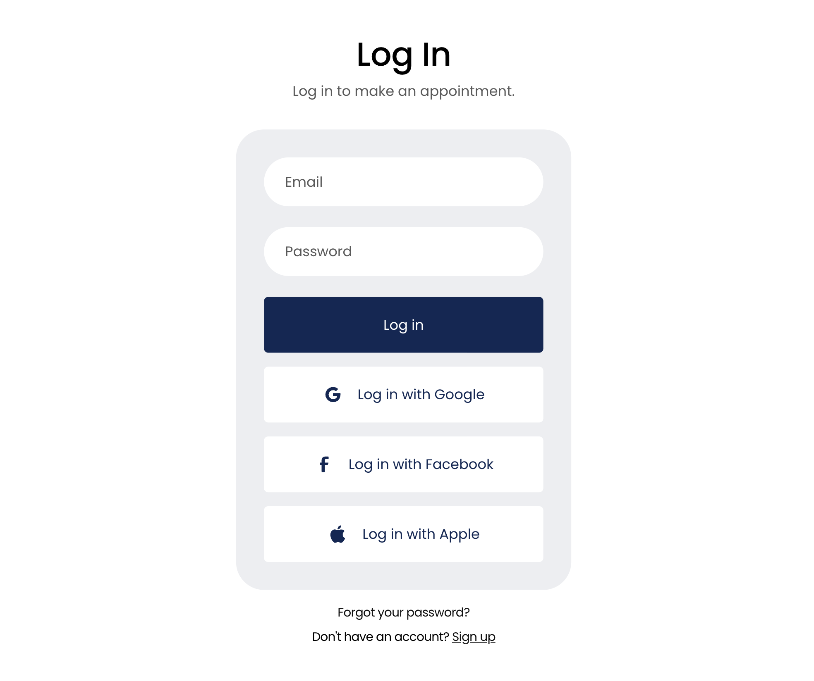

# Plugins Forms

## Overview

The objective is to create a series of **standard plugins** to use in multiple projects where the `HTML` and `css` and `images` can be arranged the designer likes, while the coding logic looks for known `id`s the the form and knows how to react to an action.

The technology cleanly separates the front-end UI design from the backend services through `Remote Procedure Calls` or **RPC**.  Data models and validate are defined on the server but shared with the browser logic.  A form, and it's elements line up with the data model.

### RPC

Remote Procedure Calls are similar to HTML `get` and `post` but they invoke functions on the server side.  Data is transfered over http by default, but can also use `web-sockets` for a more interactive experience.

## Sign In



You can see the ids for the form's html below. Ids are `signinForm-v010`, email and password.  The submit button (Log in on your wireframe) is registered with javascript on page load and knows when the button is pressed.


HTML:

```html
<section>
     <div class="w-layout-blockcontainer w-container">
       <div class="w-embed">
         <form id="signinForm-v010">
           <label for="email">Email</label>
           <input class="pluginTextInput" type="email" name="email" id="email" required maxlength="100">
           <label for="name">Password Lumiinux25!</label>
           <input class="pluginTextInput" type="password" name="password" id="password" required maxlength="100">
           <br/>
           <input class="pluginButton" type="submit" value="Log in">
         </form>
       </div>
     </div>
   </section>
```

Script:

```javascript
const form = document.getElementById('signinForm-v010');
```

For the google, facebook and apple buttons we will create a new plugin version `signinform-v020` that will register the button ids for javascript.

We might want to create a hidden field with an id of `next-page` so you can indicate where javascript will navigate to. Something like 

```html
<input class="hidden" id="next-page" value="/portal"/>
<input class="hidden" id="error-page" value="/sign-in-errors"/>
```

On a successful login, the user record is returned to javascipt.  If the user is the provider, then the `/portal` would be `/provider-portal` if not,
then `/patient-portal`.


###### dpw | 2025.07.30 

