# Web Application System Diagram

## Services

* Redis/Valkey
* socks-db
* models
* auth-service
* REST routes, middleware, logic
* static web service
* web application

## Block Diagram

## Explanation of Components and Flow

This architecture separates concerns into different logical tiers, communicating through well-defined interfaces (tcp and unix sockets and HTTP).

## **Component Roles**

### Web Application: 

This is the user interface, prototyped with WebFlow. It's delivered by the static server and runs entirely in the user's browser. Its job is to render the UI and make API calls to the backend.

### Static Web Service: 

A lightweight web server (like Caddy or Nginx) whose sole responsibility is to serve the static assets (HTML, CSS, JavaScript files) that make up the Web Application.

### REST API Gateway: 

This is the primary entry point for the client application. It handles incoming HTTP requests, performs routing, and orchestrates calls to the internal services. It acts as a facade, hiding the complexity of the internal service-to-service communication.

### Auth Service: 

A dedicated microservice for handling all authentication and authorization logic.

It communicates with Firebase (an external IdP - Identity Provider) to validate user tokens (e.g., JWTs).
It communicates with socks-db to potentially retrieve or store user session data or permissions that are kept in Redis.

### Models Service: 

This service contains the core business logic of your application. It defines how data is structured, validated, and manipulated. It doesn't know how to talk to the database directly; instead, it delegates storage operations to socks-db.

### socks-db: 

This is a crucial and unique component. It acts as a database proxy or adapter. Its main purpose is to translate requests received over high-performance Unix sockets from the Models and Auth services into raw database commands sent over TCP sockets to Redis/Valkey.

### Redis / Valkey: 

The in-memory database. It's the final destination for data storage and retrieval, only accessible via the socks-db proxy.

## **Interaction Flow (A Typical Request)**

_The numbered arrows on the diagram illustrate the lifecycle of a typical API request:_

### Initial Load: 

The user's browser requests the web page. The Static Web Service serves the necessary HTML, CSS, and JS files. The Web Application now loads and runs in the browser.

### API Call: 

The user performs an action (e.g., clicks a button to fetch data). The Web Application makes a secure API call (HTTPS) to the REST API Gateway.

### Authentication: 

The REST API receives the request, likely with an Authorization header containing a token. It calls the Auth Service over a fast Unix socket to validate this token.

### External Validation: 

The Auth Service validates the token signature, possibly by making an HTTPS call to Firebase to get public keys or check token revocation lists.

### Data Request: 

Once the user is authenticated, the REST API's logic proceeds. It calls the Models Service (again, over a Unix socket) to perform the required business operation (e.g., getSocksList()).

### DB Operation: 

The Models Service translates the business operation into a data operation and tells the socks-db service what to do via its Unix socket interface.

### Database Command: 

The socks-db proxy translates the request into the appropriate Redis command and sends it over a TCP socket to the Redis/Valkey server. The data is retrieved and the response flows back up the same chain to the user.

## Key Architectural Concepts Highlighted

### Microservices: 

The system is decomposed into small, independently deployable services (Auth, Models, socks-db).

### API Gateway: 

The REST API service acts as a single entry point for the client, simplifying the client-side code and providing a centralized place for concerns like rate limiting, authentication, and routing.

### Separation of Concerns: 

Each component has a single, well-defined responsibility. For example, Models handles business logic, while socks-db handles only database communication protocol translation.

### Socket-based IPC: 

You are using sockets for Inter-Process Communication instead of the more common HTTP/gRPC.

### Unix Sockets: 

These are used for communication between services running on the same host machine. They are generally faster and have lower overhead than TCP/IP sockets because they don't go through the network stack. This is an excellent choice for performance-critical, co-located services.

### TCP Sockets: 

Used for communication between socks-db and Redis, which is standard as they may be running on different machines in a cluster.

## What makes this Architecture "Pluggable"

* ability to swap out areas of concern, e.g., microservices
* ability to replace all html, css, and javascript with custom look and feel
* ability replace model logic with alternate model service

###### dpw | 2025-07-07 | 81TnlYRJ2nVm

