# Web Application System Diagram

## Services Overview

* **web application**: (the HTML, css, typescript, and image files)
* **reverse proxy**: to direct traffic to web pages and REST server
* **web service**: to serve the web application
* **tRPC service**: for routes, middleware, models, and logic, shared with client UI
* **auth-service**: a Firebase service to sign-up, sign-in, sign-out, etc. users
* **Valkey**: the database instance
* **S3 storage**: the secure document-store

## Block Diagram

## Explanation of Components and Flow

This architecture separates concerns into different logical tiers, communicating through well-defined interfaces (tcp and unix sockets and HTTP).

## **Component Roles**

### Web Application: 

This is the user interface, prototyped with WebFlow. It's delivered by the static server and runs entirely in the user's browser. Its job is to render the UI and make API calls to the backend.

### Reverse Proxy: 

To forward requests to backend services, both static web and REST servers via unix sockets.

### Static Web Service: 

A lightweight web server whose sole responsibility is to serve the static assets (HTML, CSS, JavaScript files) that make up the Web Application.

### REST API Service: 

This is the primary entry point for the client web application. It handles incoming HTTP requests, performs routing, and orchestrates calls to other internal services (e.g., auth service).
It defines how data is structured, validated, and manipulated. It communicates directly with the database store, Valkey.

### Auth Service: 

A dedicated Firebase service for handling all authentication logic.

* communicates with Firebase (an external IdP - Identity Provider) to validate user tokens (e.g., JWTs).
* communicates with database to potentially retrieve or store user session data or permissions/roles that are kept in Valkey.

### Valkey: 

The in-memory database. It's the final destination for data storage and retrieval

### S3/Spaces Storage

The document store holds all uploaded documents and messages.

## **Interaction Flow (A Typical Request)**

_The arrows on the diagram illustrate the lifecycle of a typical API request:_

### Initial Load: 

The user's browser requests the web page. The Static Web Service serves the necessary HTML, CSS, js, image files. The Web Application now loads and runs in the browser.

### RPC Call: 

The user performs an action (e.g., clicks a button to fetch data). The Web Application makes a secure RPC call (HTTPS) to the API.

### Authentication: 

The REST API receives the request, likely with an Authorization header containing a token. It calls the Auth Service over a fast Unix socket to validate this token.

### External Validation: 

The Auth Service validates the token signature, possibly by making an HTTPS call to Firebase to get public keys or check token revocation lists.

### Data Request: 

Once the user is authenticated, the RPC API's logic proceeds. It references the user in Valkey and verifies authorization using basic roles.

## Key Architectural Concepts Highlighted

### Microservices: 

The system is decomposed into independently deployable services (Web Pages, REST, Auth, database).

### RPC: _Remote Procedure Calls_ 

The RPC API service acts as a single entry point for the client, simplifying the client-side code and providing a centralized place for concerns like rate limiting, authentication, and routing.

### Separation of Concerns: 

Each component has a single, well-defined responsibility.

## What makes this Architecture "Pluggable"

* ability to swap out areas of concern, e.g., microservices
* ability to replace all html, css, and javascript with custom look and feel
* ability replace model logic with alternate model service

###### dpw | 2025-07-29

